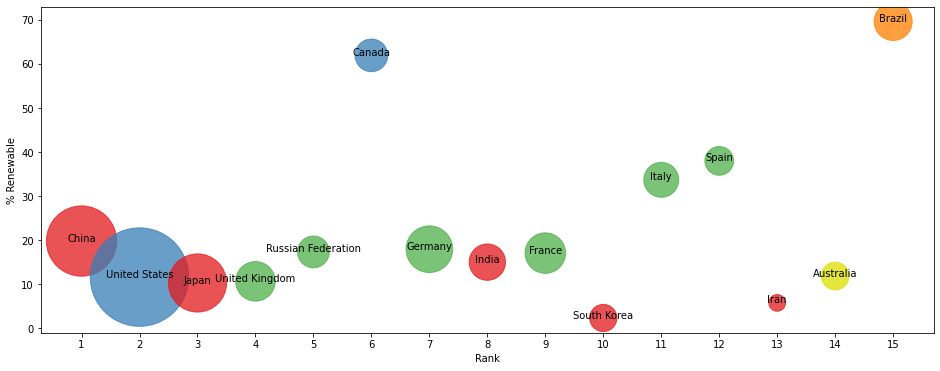

# GDP-Energy-Scholar-Data-Exploration
This projects explore the relationships among GDP, Energy Supply and Scientific Influence of Scholarly Journals of the top 15 countries ranked by ScimagoJournal indicators, over the years between 2006-2015.
## Step by step
The data wrangling process and analysis results are wrapped in functions as shown in the following.
### Data Wrangling
Create a dataframe of the energy data from the file Energy Indicators.xls, which is a list of indicators of energy supply and renewable electricity production from the United Nations for the year 2013.

Exclude the footer and header information and the first two unneccessary columns from the datafile.

Change the column labels so that the columns are:
['Country', 'Energy Supply', 'Energy Supply per Capita', '% Renewable]

Convert Energy Supply to gigajoules (Note: there are 1,000,000 gigajoules in a petajoule).

Convert missing data to np.NaN values.

Rename the following list of countries:
"Republic of Korea": "South Korea",
"United States of America": "United States",
"United Kingdom of Great Britain and Northern Ireland": "United Kingdom",
"China, Hong Kong Special Administrative Region": "Hong Kong"

Remove parenthesis, e.g. 'Bolivia (Plurinational State of)' should be 'Bolivia'.

Load the GDP data from the file world_bank.csv, which is a csv containing countries' GDP from 1960 to 2015 from World Bank. Call this DataFrame GDP.

Skip the header, and rename the following list of countries:
"Korea, Rep.": "South Korea", 
"Iran, Islamic Rep.": "Iran",
"Hong Kong SAR, China": "Hong Kong"

Load the Sciamgo Journal and Country Rank data for Energy Engineering and Power Technology from the file scimagojr-3.xlsx, which ranks countries based on their journal contributions in the aforementioned area. Call this DataFrame ScimEn.

Join the three datasets: GDP, Energy, and ScimEn into a new dataset (using the intersection of country names). Use only the last 10 years (2006-2015) of GDP data and only the top 15 countries by Scimagojr 'Rank' (Rank 1 through 15).

The index of this DataFrame are the name of the country, and the columns should be ['Rank', 'Documents', 'Citable documents', 'Citations', 'Self-citations', 'Citations per document', 'H index', 'Energy Supply', 'Energy Supply per Capita', '% Renewable', '2006', '2007', '2008', '2009', '2010', '2011', '2012', '2013', '2014', '2015'].

This function returns a DataFrame with 20 columns and 15 entries, and the rows of the DataFrame should be sorted by "Rank".

### GDP over the last 10 years
This function returns a Series named avgGDP with the TOP 15 countries and their average GDP over the last 10 years sorted in descending order.
### GDP change
This function returns the number, telling us that by how much had the GDP changed over the 10 year span for the country with the 6th largest average GDP.
### Mean energy supply per capita
### Maximum % Renewable and the percentage
This function returns a tuple with the name of the country with the maximum % Renewable the percentage.
### Highest Ratio of Self-Citations to Total Citations
This function creates a new column that is the ratio of Self-Citations to Total Citations, and returns a tuple with the name of the country that has the maximum value for this column, and the number of the highest ratio.
### Population Estimation
This function creates a column that estimates the population using Energy Supply and Energy Supply per capita, and returns the name of the country that is the third most populous country according to this estimate.
### Citable documents per person Estimation
The first function creates a column that estimates the number of citable documents per person, and returns the correlation between the number of citable documents per capita and the energy supply per capita.
The second function visualizes the relationship between Energy Supply per Capita vs. Citable docs per Capita).
### Median Filter
This function creates a new column with a 1 if the country's % Renewable value is at or above the median for all countries in the top 15, and a 0 if the country's % Renewable value is below the median, then returns a series named HighRenew whose index is the country name sorted in ascending order of rank.
### Groupby Continent - Descriptive Statistics
This function uses the following dictionary to group the Countries by Continent, then creates a DataFrame that displays the sample size, and the sum, mean, and std deviation for the estimated population of each country.

ContinentDict  = {'China':'Asia', 
                  'United States':'North America', 
                  'Japan':'Asia', 
                  'United Kingdom':'Europe', 
                  'Russian Federation':'Europe', 
                  'Canada':'North America', 
                  'Germany':'Europe', 
                  'India':'Asia',
                  'France':'Europe', 
                  'South Korea':'Asia', 
                  'Italy':'Europe', 
                  'Spain':'Europe', 
                  'Iran':'Asia',
                  'Australia':'Australia', 
                  'Brazil':'South America'}
This function returns a DataFrame with index named Continent ['Asia', 'Australia', 'Europe', 'North America', 'South America'] and columns ['size', 'sum', 'mean', 'std']
### GroupbyContinent - 5 bins
This function cuts % Renewable into 5 bins, groups Top15 by the Continent, as well as these new % Renewable bins, and returns a series telling how many countries are in each of these groups. The Series has a MultiIndex of Continent and the bins for % Renewable. The groups with no countries are not included.
### Thousands Separator
This function converts the Population Estimate series to a string with thousands separator.
e.g. 12345678.90 -> 12,345,678.90
### Bubble Chart
This function creates a bubble chart showing % Renewable vs. Rank. The size of the bubble corresponds to the countries' 2014 GDP, and the color corresponds to the continent, as shown in the following.

